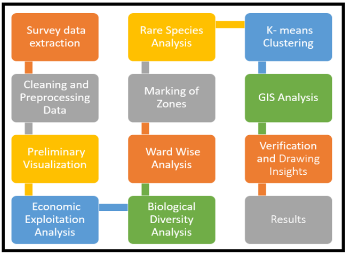

# Big Data Analytics for Sustainable Cities: Pune Tree Census Data Exploratory Analysis

This repository contains the notebooks used in [Big Data Analytics for Sustainable Cities: Pune Tree Census Data Exploratory Analysis](https://ieeexplore.ieee.org/document/9225530)

## Overview
This study aims to introduce an example of a data
science pipeline integrating Machine Learning, Statistics, Data
Visualization and GIS techniques for open big data in sustainable
development. The chosen techniques have been implemented on
the Tree Census Dataset, obtained from the geo-enabled Tree
census survey conducted by the Pune Municipal Corporation,
dated August 2019. This study focuses on the visualization of big
data, ward-wise analysis and identification of marginalized
species that require urgent attention of the authorities. The key
feature of this study is the introduction of a new biodiversity
index, to overcome the shortcomings of the existing indices, when
applied to cities in the Indian subcontinent.

## Usage
### Installation
```bash
pip install -r requirements.txt
```
To run notebooks run Jupyter and open the notebooks from there
```bash
jupyter notebook
```

## Pipeline


For more results, refer to the paper at https://ieeexplore.ieee.org/document/9225530.

## Citation
```
@INPROCEEDINGS{9225530,
  author={Marathe, Aboli and Mirchandani, Kapil and Chordiya, Kushal and Stephen, Kevin},
  booktitle={2020 11th International Conference on Computing, Communication and Networking Technologies (ICCCNT)}, 
  title={Big Data Analytics for Sustainable Cities: Pune Tree Census Data Exploratory Analysis}, 
  year={2020},
  volume={},
  number={},
  pages={1-7},
  doi={10.1109/ICCCNT49239.2020.9225530}}
  ```